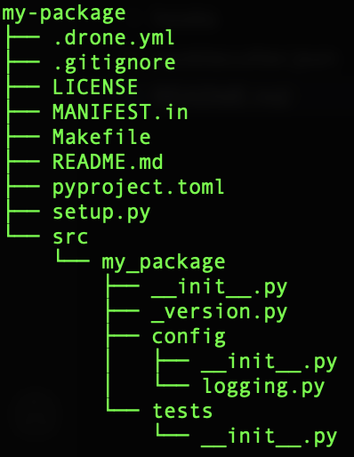

# Cookiecutter: python package

A cookiecutter is a directory template used to create directories with a predefined format.  
For instance, this repository contains cookie cutters to build python packages.  
More information can be found here: https://github.com/cookiecutter/cookiecutter

## Cookiecutter Installation
Cookiecutter is an open source application. It can be installed using the following instructions:
https://cookiecutter.readthedocs.io/en/stable/installation.html#install-cookiecutter

## Features
The directory created from this cookiecutter has the following features:

- Python package that is pip installable.
- Contains a [Makefile](%7B%7Bcookiecutter.repo_name%7D%7D/Makefile) with various useful commands (e.g test, build, upload)

## Usage
1. Clone this repository to a location of your choice (named `/path/to/cookiecutters/python_setuptools` in the rest of the documentation)
2. To create a package from this cookiecutter, run the following command. The package directory will be created
in the working directory of the terminal in which you execute the command.
```
cookiecutter /path/to/python_setuptools
```

This cookiecutter will create a directory that looks something like this:



3. (Optional but recommended) Store your package in github. If you're not sure how to create a github repository, follow the "Create a repository" section from [this article](https://docs.github.com/en/get-started/quickstart/create-a-repo).